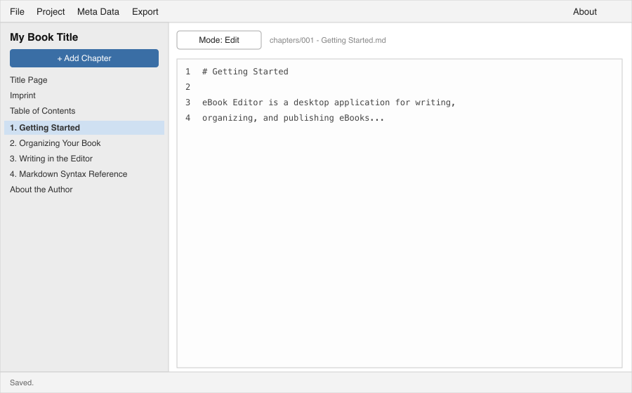

# Getting Started

eBook Editor is a desktop application for writing, organizing, and publishing eBooks. It runs on macOS, Windows, and Linux, and every book you work on lives in its own **project directory** on disk — a folder of plain Markdown files plus a small metadata file, not a single opaque document. That means your book is always readable, editable, and versionable (with a tool like Git) outside the app too.

## Requirements

eBook Editor needs the .NET 10 runtime (or later) to run. If you're building it from source, the repository pins the exact SDK version it was built against in `global.json`.

## Creating your first project

Open **File → New Project…** from the title bar menu. The wizard asks for:

- **Book title** — used as the project folder name and the book's title metadata.
- **Author first/last name** — becomes the book's first author entry; you can add more contributors, or change these, later from **Meta Data → Front Matter…**.
- **Save location** — pick the parent folder the new project directory should be created inside. Click **Browse…** to choose it.

Click **Create** and eBook Editor scaffolds a new project directory for you, complete with a title page, an imprint (copyright) page, and a table of contents — all auto-generated from the metadata you just entered — and opens it in a new window.

You can have several projects open at once: **File → New Project…** and **File → Open Project…** both open their result in an independent window, so you can work on more than one book side by side.

## Opening an existing project

**File → Open Project…** shows a folder picker. Point it at a project directory (one containing a `project.ebookproj.json` file) and it opens in a new window.

eBook Editor also remembers your **Recent Projects** (last 10, under the File menu) and reopens whatever projects were open when you last quit the app, so you don't have to hunt for them again next time.

## A tour of the main window

The main window has three parts:

- **Title bar menu** — File (new/open/save/import), Project (regenerate front matter), Meta Data (the book's metadata, split across several focused windows — see *Book Metadata*), Export (EPUB/PDF/Word/Markdown), and About.
- **Sidebar** (left) — an ordered list of everything in your book: front matter, chapters, and back matter, in the order they'll appear in the finished book. A **+ Add Chapter** button sits at the top.
- **Editor pane** (right) — shows whatever's selected in the sidebar. A **Mode: Edit / Mode: Preview** button toggles between raw Markdown editing and a rendered preview of the same content.

A status bar along the bottom shows the result of your last action (a save, an export, an error).

## Saving your work

**File → Save Project** (or **Cmd/Ctrl+S**) writes everything — the metadata file and the currently open file's contents — to disk. If you close a window with unsaved changes, eBook Editor asks whether to save, discard, or cancel first, so you won't lose work by accident.
