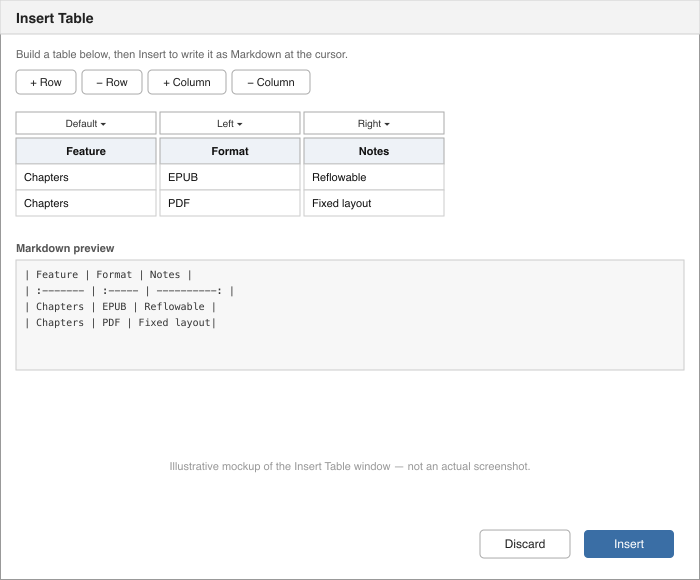

# Inserting Tables the Easy Way

Markdown tables are simple once you know the syntax (see *Markdown Syntax Reference*), but lining up all those `|` characters by hand gets tedious for anything bigger than a couple of columns. Right-click anywhere in the editor and choose **Insert Table…** for a visual builder instead.

## Building a table

The Insert Table window opens with a starting 3-column grid — the top row is the table's header, every row below it is data. Type directly into any cell.

- **+ Row** / **− Row** — add or remove a data row (there's always at least one header row and one data row).
- **+ Column** / **− Column** — add or remove a column, including its header.
- The dropdown above each column sets that column's alignment: **Default**, **Left**, **Center**, or **Right**. This controls the `:---`/`---:`/`:---:` markers in the generated separator row.

A **Markdown preview** panel at the bottom always shows exactly what will be inserted, updated live as you type or change alignment — so you can see the real syntax before committing to it.



## Inserting or discarding

- **Insert** writes the generated Markdown table at wherever your cursor was in the editor, then closes the window.
- **Discard** closes the window without changing anything.

## Example

Filling in a 3×2 table (Feature / Format / Notes headers, two data rows, right column right-aligned) produces:

```
| Feature  | Format | Notes            |
| -------- | ------ | ----------------: |
| Chapters | EPUB   | Reflowable        |
| Chapters | PDF    | Fixed page layout |
```

Cell text containing a literal `|` character is automatically escaped (`\|`) so it doesn't break the table structure, and line breaks inside a cell are collapsed to spaces, since Markdown table cells are always a single line.
