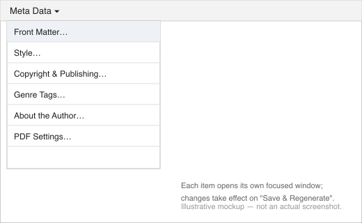

# Book Metadata

Everything that isn't chapter content — title, contributors, cover, ISBNs, genre, styling — lives under the **Meta Data** menu, split across six focused windows. Changing anything in one of them and clicking **Save & Regenerate** immediately updates the auto-generated front/back matter pages (title page, imprint, table of contents, About the Author) to match.

## Front Matter

**Meta Data → Front Matter…**

- **Title**, **Subtitle**, **Language** (a BCP-47 code, e.g. `en` or `en-GB`).
- **Authors**, **Editors**, **Illustrators** — each an independent, growable list of first/last name pairs. Click **+ Add Author** (or Editor, or Illustrator) for another row, or **✕** to remove one.

## Style

**Meta Data → Style…**

Picks the CSS template used for this book's EPUB (and now PDF — see *Exporting Your Book*) styling. Templates live in a shared `templates/` folder alongside the app, so the same set is available to every project. A "Default" template is always available; "Vellum Serif" ships alongside it as a serif, display-font option. Dropping a new `.css` file into that folder makes it available here too, the next time you open the dropdown.

## Copyright & Publishing

**Meta Data → Copyright & Publishing…**

- **Copyright holder**, **Copyright year**.
- **Publisher name** and **Publisher logo path** (relative to the project directory).
- **Cover image path** (relative to the project directory) — shown on the title page and the imprint page.
- **Publication date** (`yyyy-MM-dd`).
- **ISBN-13** and **ISBN-10**.
- **Copyright disclaimer** — the fine-print paragraph ("All rights reserved…") shown on the imprint page.
- **Where It's Sold** — a growable list of store links (e.g. Kindle Store, Apple Books, Kobo), each a store name and URL.

## Genre Tags

**Meta Data → Genre Tags…**

- **Genre Tags** — a growable list, used for the book's subject metadata.
- **Other Tags** — free-form tags, for anything genre doesn't cover.
- **Blurb** — the back-cover / store-listing description.

## About the Author

**Meta Data → About the Author…**

- **Author photo path** (relative to the project directory).
- **Author bio** — a multi-line paragraph.
- **Social Links** — a growable list of platform/URL pairs, shown on the auto-generated About the Author page.

## PDF Settings

**Meta Data → PDF Settings…**

- **Page size** — A5, A4, US Letter, US Trade, Digest, or Mass Market Paperback. This only affects PDF export; EPUB is reflowable and has no fixed page size.

## Regenerating front matter manually

Every metadata window's **Save & Regenerate** button already does this automatically, but if you ever need to force it without changing anything, use **Project → Regenerate Front Matter**.
